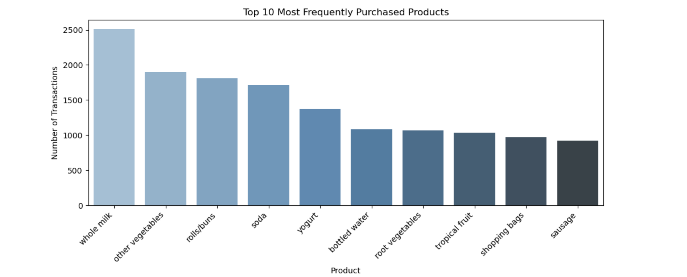
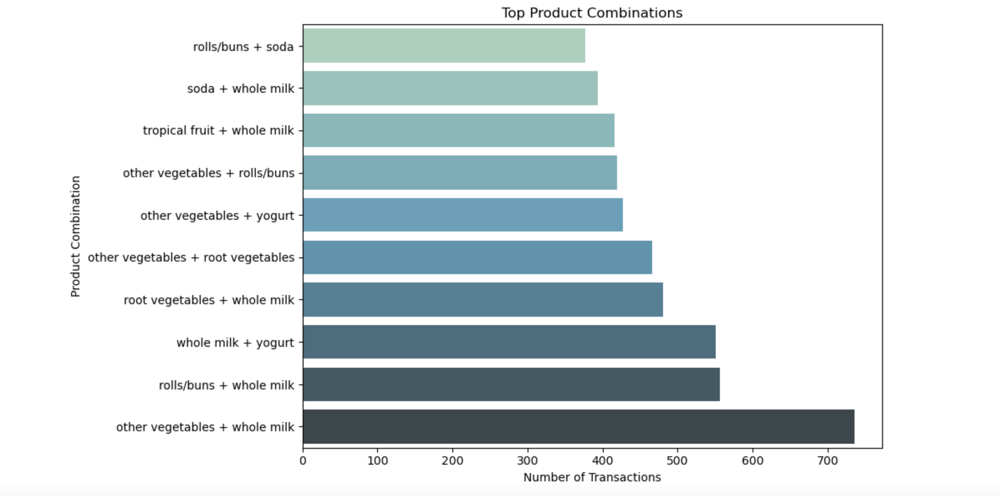
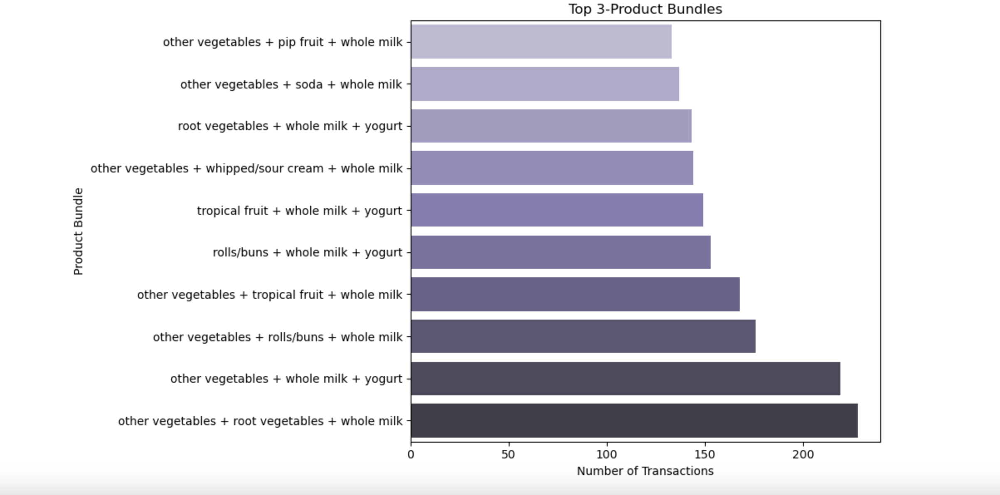

# 🛒 Market Basket Analysis for Cross-Selling

## 📌 Project Overview

This project uses **Market Basket Analysis** to identify products that customers frequently purchase together and translate these relationships into actionable **cross-selling and product bundling strategies**.

The analysis applies the **Apriori algorithm** to transaction-level grocery purchase data and evaluates product relationships using **Support, Confidence, and Lift**.

The goal is to answer a practical business question:

> **"If a customer buys Product A, what other product should we recommend?"**

---

## 🎯 Business Objective

Identify meaningful product associations that can help a grocery retailer:

* Improve cross-selling
* Increase items per transaction
* Increase Average Order Value (AOV)
* Create product bundles
* Improve "Frequently Bought Together" recommendations
* Support better product placement

---

## ❓ Business Questions

1. Which products are purchased most frequently?
2. Which product combinations occur most often in the same transaction?
3. Which product associations are strongest based on lift?
4. If a customer buys Product A, what other product should we recommend?
5. Which 3-product combinations can be used for bundle offers?
6. How can these associations be converted into actionable cross-selling strategies?

---

## 🗂️ Dataset

The project uses a **Grocery Market Basket** transaction dataset.

Each row represents a customer transaction, while the `Item 1` to `Item 32` columns contain the products purchased in that transaction.

### Dataset characteristics

* **9,835 transactions**
* Multiple products per transaction
* Missing values represent transactions containing fewer products
* Transaction-level purchase data

---

## 🛠️ Tools & Technologies

| Tool             | Purpose                             |
| ---------------- | ----------------------------------- |
| Python           | Data analysis                       |
| Pandas           | Data cleaning and manipulation      |
| NumPy            | Numerical operations                |
| Matplotlib       | Data visualization                  |
| Seaborn          | Visualization and color palettes    |
| MLxtend          | Apriori and association rule mining |
| Jupyter Notebook | Analysis environment                |

---

## 🔄 Project Workflow

```text
Raw Transaction Data
        ↓
Data Cleaning
        ↓
Transaction Preparation
        ↓
Exploratory Data Analysis
        ↓
Transaction Encoding
        ↓
Apriori Algorithm
        ↓
Frequent Itemsets
        ↓
Association Rules
        ↓
Support + Confidence + Lift
        ↓
Cross-Selling Recommendations
        ↓
Bundle Opportunities
        ↓
Business Recommendations
```

---

## 📊 Analysis Performed

### 1. Data Cleaning & Preparation

* Inspected the transaction dataset
* Identified product columns
* Handled missing values
* Converted each transaction into a list of purchased products

### 2. Exploratory Data Analysis

Analyzed the most frequently purchased products and identified high-volume products that can act as **anchor products** for cross-selling.

### 3. Market Basket Analysis

Applied the **Apriori algorithm** to identify frequent product combinations.

The analysis uses:

```python
min_support = 0.01
max_len = 3
```

The `max_len=3` restriction focuses the analysis on individual products, product pairs, and practical 3-product bundles.

### 4. Association Rule Mining

Generated rules using:

* Support
* Confidence
* Lift

### 5. Product Recommendations

Created a simple recommendation function that identifies products to recommend based on a customer's current purchase.

### 6. Bundle Analysis

Analyzed frequently occurring 3-product combinations to identify potential bundle offers.

---

## 📸 Key Visualizations

### 1. Top 10 Most Frequently Purchased Products


### 2. Most Frequent Product Combinations



### 3. Top Product Bundles




# 🔑 Key Business Insights

### 🥛 1. Whole Milk is the Strongest Anchor Product

**Whole milk** is the most frequently purchased product, appearing in **2,513 transactions**, or approximately **25.6% of all transactions**.

**Business implication:**
Whole milk can be used as an anchor product for targeted cross-selling recommendations.

---

### 🥕 2. Other Vegetables + Whole Milk is the Most Common Pair

The combination of **other vegetables + whole milk** occurs in **736 transactions**, representing **7.48% of all transactions**.

Other frequently occurring combinations include:

* Rolls/buns + whole milk
* Whole milk + yogurt
* Root vegetables + whole milk
* Other vegetables + root vegetables

**Business implication:**
These combinations are strong candidates for **"Frequently Bought Together"** recommendations.

---

### 🥩 3. Beef → Root Vegetables is a Strong Association

The association:

> **Beef → Root vegetables**

has:

* **Confidence:** 33.1%
* **Lift:** 3.04

A lift above 1 indicates a positive association, while a lift of 3.04 indicates a particularly strong relationship.

**Business implication:**
When a customer adds beef to their cart, root vegetables can be recommended as a complementary product.

---

### 🍓 4. Yogurt Has Useful Complementary Associations

Yogurt shows useful relationships with products including:

* Whole milk
* Other vegetables
* Rolls/buns
* Tropical fruit

The **Yogurt → Tropical fruit** relationship has a lift of approximately **2.00**.

**Business implication:**
The retailer can test yogurt-based recommendations and complementary product combinations.

---

### 🛍️ 5. Three-Product Bundles Offer Promotional Opportunities

The most common 3-product combination is:

> **Other vegetables + Root vegetables + Whole milk**

It appears in **228 transactions**, representing approximately **2.32% of all transactions**.

**Business implication:**
This combination can be tested as a grocery bundle or promotional offer.

---

# 💡 Business Recommendations

### 1. Implement "Frequently Bought Together"

Use high-confidence association rules to recommend complementary products when customers add an item to their cart.

**Example:**

```text
Customer adds Beef
        ↓
Recommend Root Vegetables
```

---

### 2. Create Product Bundles

Test bundles based on frequently purchased 3-product combinations.

Example:

```text
Other Vegetables
       +
Root Vegetables
       +
Whole Milk
```

---

### 3. Improve Product Placement

Frequently associated products can be positioned closer together in physical stores to encourage additional purchases.

---

### 4. Personalize Cross-Selling

Instead of recommending only the most popular products, use **confidence and lift** to generate recommendations based on what the customer has already purchased.

---

### 5. Measure Business Impact

After implementing recommendations, the retailer should track:

* Average Order Value
* Items per Transaction
* Cross-Sell Conversion Rate
* Bundle Purchase Rate
* Recommendation Click-Through Rate

---

## 📈 Key Metrics Explained

### Support

Measures how frequently a product combination occurs across all transactions.

### Confidence

Measures how often the consequent is purchased when the antecedent is purchased.

For example:

```text
Beef → Root Vegetables
Confidence = 33.1%
```

This means approximately 33.1% of transactions containing beef also contain root vegetables.

### Lift

Measures how much stronger an association is compared with what would be expected from independent purchasing.

```text
Lift > 1  → Positive association
Lift = 1  → No meaningful association
Lift < 1  → Negative association
```

---

## 📁 Project Files

```text
Market-Basket-Analysis/
│
├── Market_Basket_Analysis_Cross_Selling_Seaborn_Palettes.ipynb
├── groceries - groceries.csv
└── README.md
```

---

## 🚀 Skills Demonstrated

This project demonstrates practical skills in:

* Python
* Pandas
* Data Cleaning
* Exploratory Data Analysis
* Data Visualization
* Seaborn
* Apriori Algorithm
* Association Rule Mining
* Support
* Confidence
* Lift
* Business Analysis
* Cross-Selling Strategy
* Product Bundling
* Translating Data into Business Recommendations

---

## 🎯 Portfolio Takeaway

This project demonstrates how a Data Analyst can move beyond simply analyzing data and translate customer transaction patterns into **actionable business decisions**.

The analysis follows the complete journey:

> **Transaction Data → Analysis → Product Associations → Recommendations → Business Strategy**

The final output can support **cross-selling, product recommendations, bundle promotions, and product placement decisions**.
